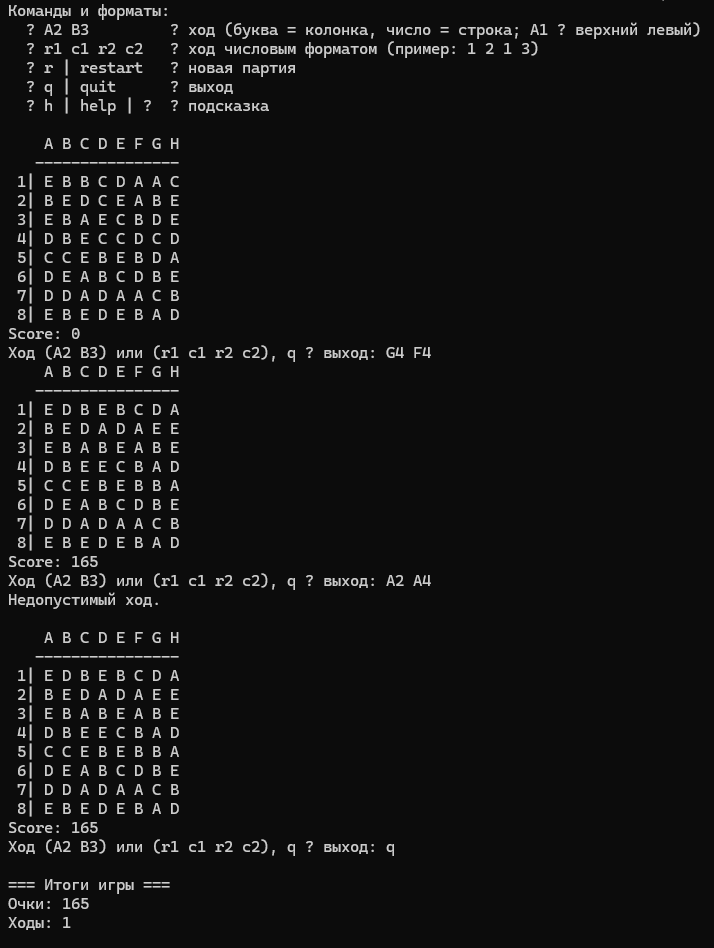

Игра "Три в ряд" (Match-three-game)

Проект консольной игры "Три в ряд", на основе методики проектирования Бертрана Мейера  

Для запуска программы необходимо склонировать репозиторий/
В консоли перейти в директорию с проектом и выполнить команды (для PowerShell):

mvn -q clean package; java -jar target\ThreeInARow-0.0.1-SNAPSHOT-all.jar

